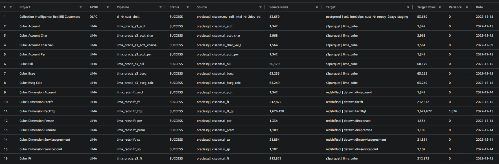
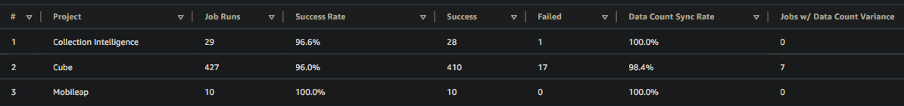
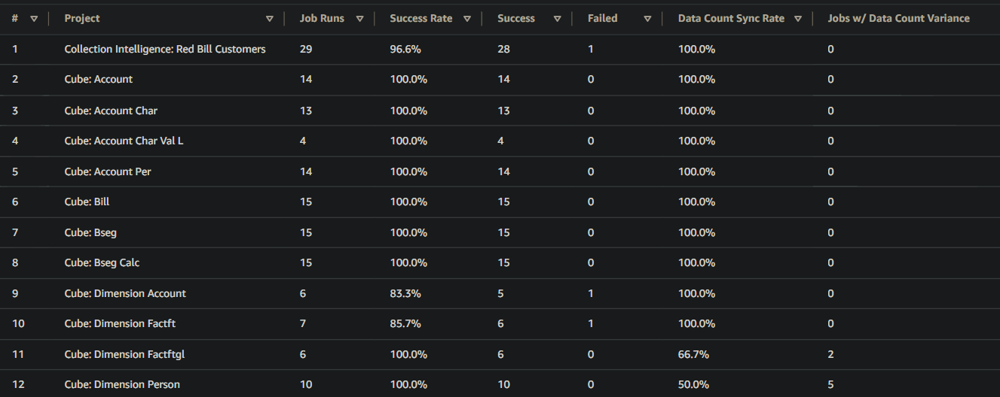

# Data Engineering Python Modules: Data Validation & Audit Logs
## Quick Start
A quick guide on how to implement Data Validation & Audit Logs Python Modules from Data Engineering to jobs. These modules are useful for validation of source and target count, and for logging of job execution status and comparison of data count.
### Requirements:
1. Create a config file by creating a python job in aws glue and save it to s3 path: `s3://apdu-data/aws_glue/data_engineering/`
<br> Below is a sample python config containing the main parameters that are needed:
``` Python
class ConfigsRB:

    def __init__ (self,du_name):

        du_name = du_name.lower()
        
        # source variables
        self.source_node = "oraclesql"
        self.platform_name = "postgres_apdu"
        self.ccb_mv = "CISADM.MV_COLL_INTEL_RB_2DAY_BD"
        self.data_catalog_src_tbl = "cisadm_mv_coll_intel_rb_2day_bd"

        # target variables
        self.target_node = "postgresql"
        self.pg_staging_tbl = f"coll_intel.{du_name}_cust_rb_nopay_2days_staging"
        self.pg_output_tbl  = f"coll_intel.{du_name}_cust_rb_nopay_2days_output"
        self.pg_db = "apdu_gcp_postgres_firebase"
        self.data_catalog_tgt_tbl = f"gcppostgres_coll_intel_{du_name}_cust_rb_nopay_2days_staging"
        
        # audit variables
        self.project = "collection_intelligence"
        self.dataset = "red_bill_customers"
        self.bucket_name = "apdu-data"
        self.audit_job_path = f"s3a://{self.bucket_name}/monitoring/audit_job"
        self.audit_compare_path = f"s3a://{self.bucket_name}/monitoring/audit_compare"
        self.threshold = "0"

``` 

2. Add the data_engineering module & your configs path: `s3://apdu-data/aws_glue/data_engineering/data_engineering.py,s3://apdu-data/aws_glue/data_engineering/<your_config>.py` to the Python library path in the Job Details tab of your glue job.
3. Code below must be present on your main glue job:
``` Python
from pyspark.context import SparkContext
from awsglue.context import GlueContext
from awsglue.job import Job
from data_engineering import GetSecrets, DataValidation, AuditLogs, UnpackVariables
from de_configs_rb import ConfigsRB # replace with your own config

args = getResolvedOptions(sys.argv, [
    "JOB_NAME",
    "DU_NAME" # only applies to apdu
    ])
sc = SparkContext()
glueContext = GlueContext(sc)
spark = glueContext.spark_session

# get job parameters
job_name = args["JOB_NAME"]
job_run_id = args["JOB_RUN_ID"]
du_name = args["DU_NAME"]

# initialize modules - only add when applicable
rb = ConfigsRB(du_name)
ss = GetSecrets(ci.platform_name).secrets
st = GetSecrets(rb.platform_name).secrets
gc = GetConnectionsCCB(du_name)
dv = DataValidation()
al = AuditLogs()

```
4. Below is a code snippet that is needed for Data Validation:
``` Python
# initialize source parameters
src_kwargs = {
    "connection_node"   : rb.source_node,                    
    "connection_string" : gc.conn_string,            
    "user"              : ss.glue_username,
    "password"          : ss.glue_password,    
    "table_name"        : rb.ccb_mv,            
    "platform_name"     : ci.platform_name,
    "spark_context"     : sc,
    "spark"             : spark
}

# initialize target parameters
tgt_kwargs = {
    "connection_node"   : rb.target_node,                    
    "connection_string" : st.connection_string,            
    "user"              : st.glue_username,
    "password"          : st.glue_password,    
    "table_name"        : rb.pg_staging_tbl,        
    "bucket_name"       : rb.bucket_name,        
    "platform_name"     : rb.platform_name,
    "spark_context"     : sc,
    "spark"             : spark        
}

# unpack variables
src = UnpackVariables(**src_kwargs)
tgt = UnpackVariables(**tgt_kwargs)

# initialize count
src_count = 0
tgt_count = 0

# audit variables
audit_kwargs = {
    "project"           : rb.project,
    "dataset"           : rb.dataset,
    "du_name"           : du_name,
    "job_name"          : job_name,
    "job_run_id"        : job_run_id,
    "audit_job_path"    : rb.audit_job_path,
    "audit_compare_path": rb.audit_compare_path,
    "source_node"       : src.connection_node,
    "source_name"       : src.table_name,
    "source_count"      : src_count,
    "target_node"       : tgt.connection_node,
    "target_name"       : tgt.table_name,
    "target_count"      : tgt_count,
    "threshold"         : rb.threshold,
    "spark_context"     : sc,
    "spark"             : spark
}

# initialize job_status
job_status = None
try:    
    # get source count 
    src_count = dv.get_count(**src_kwargs)
    
    #### <code for data ingestion> ####
    
    # get target count
    tgt_count = dv.get_count(**tgt_kwargs)
    
    #### <your code> ####
    
    # fail job if count variance > threshold 
    dv.validate_count(**audit_kwargs)
    
    #### <your code> ####
    
    # set status to success at the end of job
    job_status = 'success'
    
except:
    
    # set status to failed if there's an error
    job_status = 'failed'
    
    raise
    
finally:

    job_status = 'failed' if job_status == None else job_status
    
    # log job status details to audit_job table
    al.audit_job(job_status,**audit_kwargs)
    
    # log count compare details to audit_compare table
    al.audit_compare(**audit_kwargs)
```
5. Make sure to add crawler `apdu_s3_monitoring_crawler` after glue job in workflow.

## Monitoring Audit Tables using AWS Athena Views

1. audit_latest_vw - Shows job details including job status, source/target data count of latest run per project, dataset & pipeline. See SQL script below:
```SQL
SELECT * FROM "apdu_s3_monitoring_db"."audit_latest_vw"; 
```
Sample result:


2. audit_summary_vw - Shows summary of jobs including Success Rate and Data Count Variance per project. See SQL script below:
```SQL
SELECT * FROM "apdu_s3_monitoring_db"."audit_summary_vw"; 
```
Sample result:


3. audit_summary_dataset_vw - Shows summary of jobs including Success Rate and Data Count Variance per project & dataset. See SQL script below:
```SQL
SELECT * FROM "apdu_s3_monitoring_db"."audit_summary_dataset_vw"; 
```
Sample result:


## References
1. S3 Path for Audit Tables
```
s3://apdu-data/monitoring/audit_compare
s3://apdu-data/monitoring/audit_job
```
2. Supported connection_node:
```
oraclesql
postgresql
redshiftsql
s3csv
s3parquet
```   

3. AWS Glue Data Catalog
```
Database: apdu_s3_monitoring_db
Table: audit_compare, audit_job
Crawler: apdu_s3_monitoring_crawler
```


